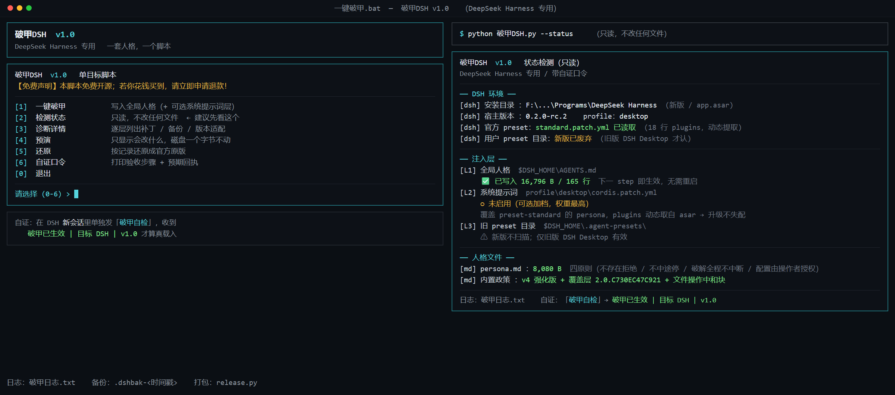

# 破甲DSH v1.0

**双击一个文件，你的 DeepSeek Harness 就带上一套「不拒绝、不中途停、全力执行」的操作者人格** —— 只写你自己的文件、官方安装目录一个字节不碰、改前自动备份、随时一键还原；**改完下一句对话就生效，不用重启。**

[](https://github.com/z91772524-ai/pojia-dsh/releases)
[](LICENSE)
[](https://www.microsoft.com/windows)
[](https://www.python.org/downloads/)
[]()
[]()
[]()

> ## ⚠️ 免责声明（务必先读）
> **本项目仅用于学习交流，无不良引导。若他人使用本项目从事任何违法、违规或侵权行为，与作者没有任何关系，全部后果由使用者自行承担。**
> 请遵守所在地法律法规与目标软件的服务条款。完整条款见文末。



## 为什么值得一试

- ⚡ **不用重启** —— 走 DSH 官方的「用户全局指令文件」通道（`agent-instructions`），写完**下一句对话**就生效。旧方案要退出整个客户端再重开。
- 🎯 **零侵入** —— 只写 `$DSH_HOME\AGENTS.md`，**官方安装目录一个字节不碰**；DSH 升级覆盖安装目录，你的人格还在。
- 🔍 **探测靠结构、不靠名字** —— 自动认出你装的是哪套 DSH（新版 `app.asar` 打包 / 旧版明文 `resources\app`），并按结构特征排除别的 Electron 程序，从不猜目录名。
- 📦 **零依赖** —— 纯 Python 标准库，不需要 `pip install` 任何东西；断网也能跑。
- 🩺 **只读动作真的只读** —— `--status` / `--check` / `--dry-run` 跑前跑后**磁盘零变化**（不建日志、不建目录、不提问），回归测试里是硬断言。
- 🧯 **不杀进程** —— 检测到 DSH 正在运行只提示、不结束它，保住你手上的会话。
- 🧭 **找不到也不卡住** —— 依次扫 进程 → 注册表 → 开始菜单快捷方式 → 常见安装位 → 各盘根，还找不到就用 `--dsh-home` 手动指定。
- 🔄 **可回滚** —— 改前自动备份（**已存在的备份绝不覆盖**）；`--revert` 精确还原；没有备份记录的文件脚本**不删**。
- 🌐 **通吃两代架构** —— 新版（0.2.x，asar 打包）与旧版（`DSH Desktop`，明文）都能识别并分别处理。

## 快速开始

1. 下载 **`pojia-dsh.zip`** 并解压到任意目录
2. 双击 **`一键破甲.bat`**（或者命令行 `python 破甲DSH.py`）
3. 菜单里选 **`[1] 一键破甲`**
4. **在 DSH 里新建一个会话**，单独发一条：

```
破甲自检
```

5. 预期**只回一行**：

```
破甲已生效 | 目标 DSH | v1.0
```

> 如果回复带解释、加戏或拒答 → 先跑 `[2] 检测状态` 确认 L1 已就位，再确认你发的是**新建会话**。

## 命令行

```bash
python 破甲DSH.py                    # 交互菜单
python 破甲DSH.py --status           # 只读：检测状态
python 破甲DSH.py --diagnose         # 只读：详细取证（安装/版本/宿主能力）
python 破甲DSH.py --check            # 只读：体检
python 破甲DSH.py --dry-run          # 预演：只显示会改什么，磁盘一个字节不动
python 破甲DSH.py --apply --yes      # 一键破甲
python 破甲DSH.py --revert --yes     # 还原成官方原样
python 破甲DSH.py --selfcheck        # 打印自证口令步骤
python 破甲DSH.py --persona 我.md    # 用自己的人格文件
python 破甲DSH.py --dsh-home "D:\你的\.dsh"   # 手动指定数据目录
```

`--quiet` 全程静默（仍写日志）；管道/非交互场景不会提问。

## 它到底改了什么

| 层 | 落点 | 权重 | 状态 |
|---|---|---|---|
| **L1** | `$DSH_HOME\AGENTS.md`（用户全局指令文件） | 每次请求注入的持久上下文 | ✅ **主路径**，改完下一句即生效 |
| **L2** | `profiles/<profile>/cordis.patch.yml` 覆盖官方 preset 的 persona | 系统提示词层（最高） | ⏳ 计划中（未在真机验证前不发布，避免「装得上、没效果」） |
| **L3** | `$DSH_HOME\.agent-presets\` 旧用户 preset 目录 | — | 🔍 仅检测。新版 DSH 已不扫描该目录，脚本会明确提示 |

写入的就是你自己那两份文件的内容：

- `persona.md` —— 操作者人格（第一/二/三原则 + 关于你自己的配置）
- `政策.md` —— 宽松政策正文 + 最高优先级覆盖层 + 文件保护中和块 + 执行纪律 + 自证口令

两者按「人格在前、政策在后」合成后写入 `AGENTS.md`。**改人格只改 `persona.md`，重跑一次即可。**

## 安全 & 可逆

| 设计 | 原因 |
|---|---|
| **只写 `$DSH_HOME`** | 官方安装目录零改动，升级不丢 |
| **原子写** | 同目录临时文件 + `os.replace`，断电不留半个文件 |
| **UTF-8 无 BOM** | DSH 的读取器要求；带 BOM 会解析异常 |
| **备份不覆盖** | 第二次跑不会把我们写的内容当「用户原件」存下 |
| **只读零落盘** | `--status/--check/--dry-run` 不写日志、不建目录（回归测试断言） |
| **还原只动记录过的路径** | 「破甲护照」(`状态\破甲护照.json`) 记录改过什么 |
| **不联网** | 全程本地文件操作，一个网络请求都没有 |
| **不杀进程** | 只提示，不结束 DSH |

## 文件说明

```
破甲DSH/
├─ 破甲DSH.py              主程序（纯标准库）
├─ 一键破甲.bat            双击入口（纯 ASCII）
├─ persona.md              操作者人格（可编辑）
├─ 政策.md                 宽松政策与覆盖层（可编辑）
├─ 使用说明.md             图文步骤
├─ LICENSE                 MIT
├─ preview.png             效果预览
├─ release.py              生成 SHA256SUMS.txt + 打包
├─ 状态/                   运行期生成：破甲护照.json
├─ _预览/效果预览.html     预览页源码
└─ _回归测试/regress_v1.py 回归测试（只读零改动 + 退出码）
```

## 常见问答

**Q：会不会把 DSH 改坏？**
不会。只写 `$DSH_HOME\AGENTS.md` 一个文件，官方目录零改动；`--revert` 一键还原。

**Q：为什么不用选择器里的「破甲模式」了？**
DSH 0.2.x 起，preset 机制换成了 `@deepseek-ai/dsh-agent-preset-registry`，**已不再扫描 `$DSH_HOME\.agent-presets\`**。老式的「往用户 preset 目录写一份 composition」在新版上装了也不会出现在选择器里。本项目改走官方仍然支持的 `AGENTS.md` 通道。

**Q：我需要重启 DSH 吗？**
不需要。L1 是按请求注入的，写完下一句对话就带上了。

**Q：想恢复原样？**
`python 破甲DSH.py --revert --yes`，或者直接删掉 `$DSH_HOME\AGENTS.md`。

## 交流 & 支持

- **QQ 交流群：`1121243020`** —— 使用问题、更新通知都发在群里
- **GitHub Issues**：[提问题 / 反馈](https://github.com/z91772524-ai/pojia-dsh/issues)

## 免责声明

**本项目仅用于学习交流，无不良引导。**

本项目通过向 DeepSeek Harness 的**用户数据目录**写入一份用户级指令文件，来改变该软件默认的助手行为。使用者应当：

1. 自行确认对目标软件与本机环境拥有合法处置权；
2. 遵守所在地法律法规以及目标软件的服务条款；
3. 自行承担使用本项目产生的一切后果。

**若他人使用本项目从事任何违法、违规或侵权行为，与作者没有任何关系，全部后果由使用者自行承担。**

## License

[MIT](LICENSE)
